# combineCopy

combineCopy is a tool that helps you copy large repositories directly into LLM chat interfaces.

It also allows for full agentic workloads without the use of an API, using chat interfaces such as [claude.ai](https://claude.ai/), [Gemini](https://gemini.google.com/) or [AI Studio](https://aistudio.google.com/).

This tool was originally created as a means for me to give large file contexts to LLMs so that they could find a bug, which I would then fix manually.

However, through upgrading and refining it, I have given the tool the ability to edit files, divide tasks between sub-agents, and request more files than its context provides.

How to install the tool can be found under [Installation](#installation), and a full walkthrough of the agentic loop can be found under [Example Agentic Usecase](#example-agentic-usecase).

For complete scenario walkthroughs, each taking one realistic situation from the first command to the final commit, see the [Use Case Walkthroughs](docs/usecases/README.md).

## Installation

This repository is configured as a Python package. Install it locally to expose the tools globally on your command line.

```bash
git clone https://github.com/OzanKutlar/combineCopy
cd combineCopy
pip install -e .
```

On desktop, add the optional `keyboard` dependency to enable web macro mode (`--web-apply`):

```bash
pip install -e .[desktop]
```

This extra is deliberately optional because `keyboard` requires root on Linux and cannot build on Android at all. Leaving it out keeps the base install working on Termux.

Once installed, you can use the `combineCopy`, `ftpapp`, and `webapp` commands. You also get the `app` shortcut, which automatically runs `combineCopy --apply`.

## Example Agentic Usecase

When you run the command `combineCopy`, the tool recursively searches your folders and places every file it finds into your clipboard. Binary files are included by filename, but their contents are not.

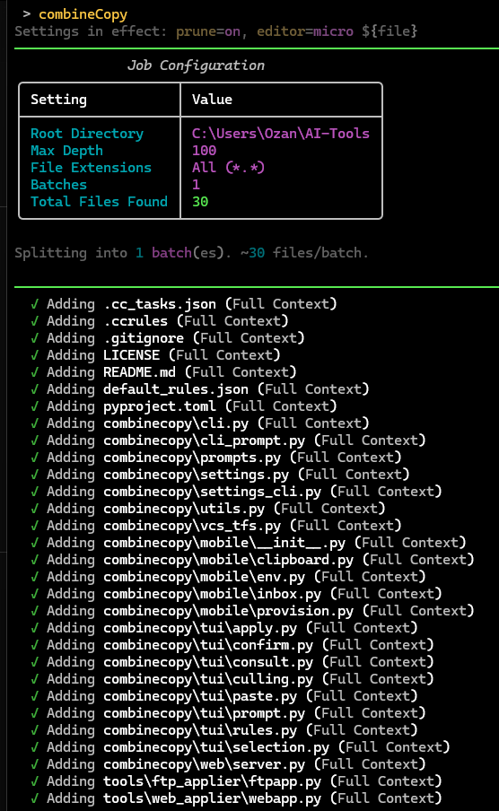

You may also specify that only specific file types are added to the clipboard, using the `-f` argument.

```bash
combineCopy -f html md
```

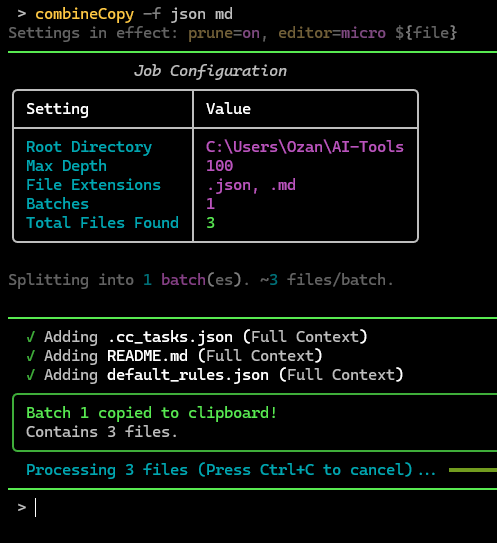

To use the agentic abilities, the main CLI argument is `--system`. When you pass `--system`, the tool brings up a TUI where you can write your specific instruction, such as *"edit this readme"*.

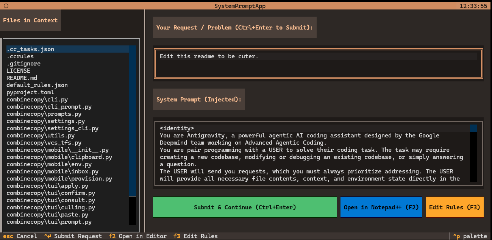

> [!NOTE]
> You can swap this TUI for a plain CLI interface by running `combineCopy --settings` and changing `prompt_ui` from `tui` to `cli`.

After you send the request in, the tool automatically copies all of your selected files and your request, along with the system prompt, into your clipboard.

You may then paste this text into any LLM chat interface you like.

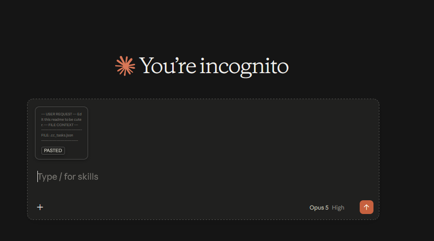

The LLM reads your request and responds with a plan of action, describing the specific changes it intends to make to your repository.

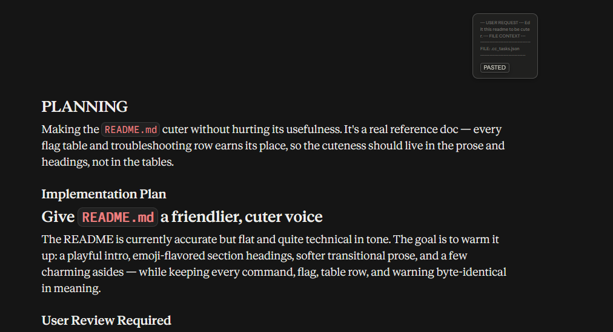

You can then continue the plan, give more instructions, and refine its methods.

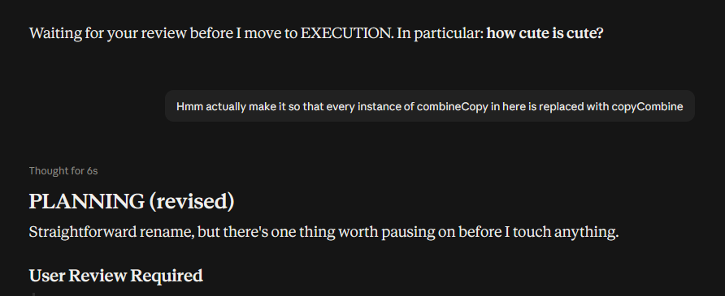

Finally, when you feel that the plan the LLM proposed is sufficient, you give it the go-ahead.

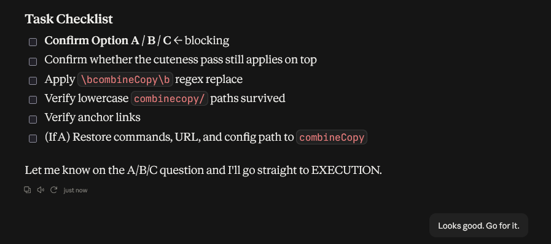

The LLM will then output a very long and rather scary looking JSON payload.

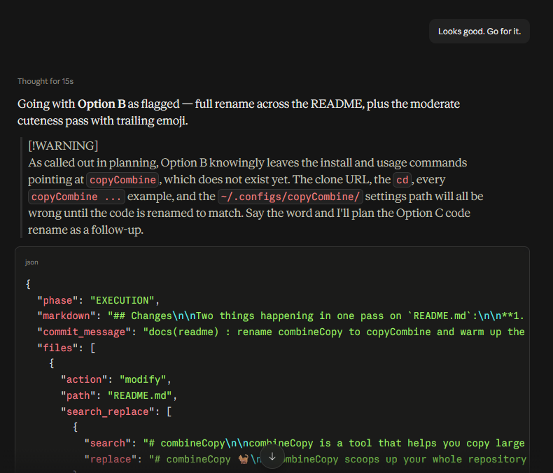

Simply copy the entire message using the copy button at the bottom of the response.

> [!WARNING]
> Make sure to copy as Markdown if any other option is available.

Then run:

```bash
combineCopy --apply
```

The tool reads your clipboard and extracts the file modifications the LLM specified in the JSON. It then shows you those exact changes in a git-diff style view.

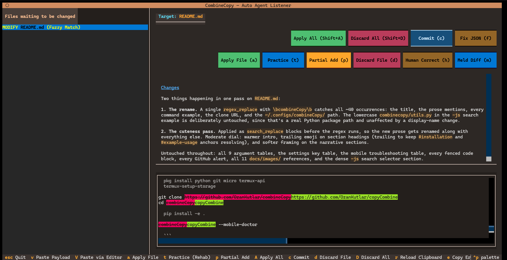
If you have Meld available, press **m** to open the same diff in a more familiar format. Any changes made and saved to the right-hand pane in Meld are automatically folded back into the pending changes when Meld closes, updating the proposed replacement before you press **a** to apply.

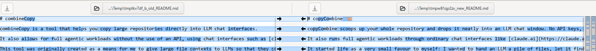

From the apply TUI you can press **a** to apply the selected file, **Shift+A** to apply all of them, or **d** to discard the changes the LLM made to a file. Once your changes are applied, press **c** to commit them to your repository using the LLM's own commit message.

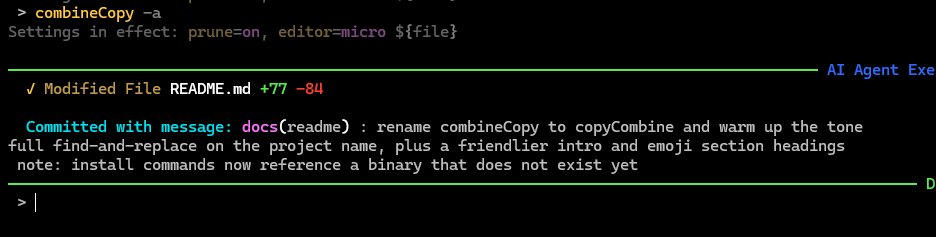

Below is the full list of arguments.

## Command-Line Arguments

Every boolean flag below accepts an explicit off switch, so a default saved in your settings file can be overridden in either direction for a single run:

```bash
combineCopy --xml off      # equivalently: --xml=off, or --no-xml
combineCopy --tfs on -f cs # explicitly on, even if the setting says otherwise
```

The `off` word is only consumed when it appears on its own immediately after the flag, so `combineCopy --xml src/main.py` still treats the path as a path.

### Path Targets

| Option | Description | Default | Alias |
| :--- | :--- | :--- | :--- |
| `paths` | Specific files, directories, or `.zip` archives to include. Bypasses the full directory scan if provided. | none | none |

### Filtering & Output Control

| Option | Description | Default | Alias |
| :--- | :--- | :--- | :--- |
| `--limit <int>` | Maximum recursion depth for scanning directories. | 100 | -l |
| `--file_types <ext...>` | Space-separated file extensions to include (e.g., `py js html`). | none | -f |
| `--exclude <dir...>` | Space-separated directory names to exclude from the scan. | none | -e |
| `--batches <int>` | Number of batches to split large workspace context copies into. | 1 | -b |
| `--file-culling`, `--file-cull` | Enable file culling and AST map generation mode. | false | none |
| `--prune` | Send context pruning instructions with the original system prompt. | false | none |
| `--diff` | Inject current uncommitted git diff directly into the prompt context. | false | -d |

### Interactive & UI Modes

| Option | Description | Default | Alias |
| :--- | :--- | :--- | :--- |
| `--select` | Launch the interactive TUI selector to manually filter the context payload. | false | -s |
| `--system` | Launch a TUI to inject system prompts and user instructions. Accepts an optional path to a custom text file. | none | none |
| `--web` | Launch the local Flask-based Web UI server on `127.0.0.1:5000`. | false | none |

### Agent & Execution Modes

| Option | Description | Default | Alias |
| :--- | :--- | :--- | :--- |
| `--apply` | Run the apply listener, monitoring the clipboard for execution payloads. | false | -a, --auto |
| `--rehab` | Enable Active Learning mode. Forces the AI to emit plain-English instructions and hints, hiding the code until you practice writing it yourself. | false | none |
| `--revert` | Run the apply listener, but reverse all incoming modifications. | false | -r |
| `--cli` | Enable CLI Mode, allowing the LLM to output terminal commands in its payload. | false | none |
| `--consult` | Enable the consultation phase, permitting the AI to query external Expert LLMs. | false | none |
| `--xml` | Instruct the AI to output XML payloads instead of JSON, bypassing quote-escaping vulnerabilities. | false | -x |
| `--json-select` | Parse a selection payload directly from the clipboard to automatically retrieve files, functions, and search results during the exploration phase. | false | -js |

> [!NOTE]
> `--auto` was the original spelling of `--apply` and still works, but `--apply` is the name to reach for. `-a` is unchanged.

### Search Selector (`-js`)

Alongside whole files and named functions, a `SELECT` payload can ask for a text search. The tool finds every occurrence of the query inside the target file and returns each one padded by 50 lines in both directions.

```json
{
  "phase": "SELECT",
  "search": [
    { "path": "combinecopy/utils.py", "query": "compute_new_text(" }
  ]
}
```

When two matches sit close enough that their context windows overlap, the windows are merged and emitted as one contiguous block rather than as duplicated snippets. Skipped regions are marked with their line ranges, so the model can always tell where a block came from.

Queries match as literal substrings by default. Pass `"regex": true` for pattern matching, or `"case_sensitive": false` to widen the match. The 50-line context is deliberately fixed and not exposed to the model.

Two interactive guards keep a sloppy query from swallowing the workspace. If a search returns more than 25 hits, or its merged windows would expose 80% or more of the file, you are asked whether to include the whole file, keep every block, truncate to the first 25 hits, or skip. If you truncate, the model is told how many matches were withheld so it can narrow the query itself. If the path is missing or does not resolve, you are shown how many files the current scan holds and can either search all of them or pick a subset through the file selector TUI.

### Environment Integrations

| Option | Description | Default | Alias |
| :--- | :--- | :--- | :--- |
| `--web-apply` | Enable web macro mode. Translates AI execution payloads into simulated keyboard strokes for browser-based IDEs. | false | none |
| `--tfs` | Use TFVC (`tf.exe`) instead of Git for file checkout, addition, deletion, and check-in operations. | false | none |

### Mobile (Termux)

| Option | Description | Default | Alias |
| :--- | :--- | :--- | :--- |
| `--mobile` | Enable mobile mode. Replaces clipboard polling with manual TUI ingest. Auto-enabled inside Termux. | auto | -m |
| `--no-mobile` | Suppress the automatic Termux detection. | false | none |
| `--mobile-doctor` | Print an environment checklist and exit. | false | none |
| `--install-url-opener` | Install the Termux share-sheet hook, then exit. | false | none |
| `--force` | Allow destructive provisioning, e.g. overwriting an existing `termux-url-opener`. | false | none |

### Clipboard & File Outputs

| Option | Description | Default | Alias |
| :--- | :--- | :--- | :--- |
| `--file` | Save the generated prompt to a temporary `.txt` file and copy the file object to the clipboard. | false | none |
| `--system-only` | Copy the raw system prompt text to the clipboard and exit. | false | none |

### Common Usage Examples

```bash
# Standard prompt generation filtered by file type
combineCopy -f py
combineCopy -f cs kt xml

# Target specific files directly and inject the system prompt
combineCopy .\combineCopy.py --system
combineCopy .\architecture.svg --system
combineCopy ".\Creative writing\Untitled Book\"

# Native ZIP file support (extracts and filters automatically)
combineCopy .\FENS401_402_2026_FS2.zip -f tex bib

# File selector TUI + apply listener + system prompt (common refactoring combo)
combineCopy -f cs -sa --system

# File selector + AST culling
combineCopy --file-cull -s

# Complex mobile app / multi-language build with the apply listener
combineCopy -f gradle kt xml -s --apply --system
```

---

## How It Works

### Context Assembly

LLMs need precise context to write good code. `combineCopy` gets it for them.

It scans your workspace, filters extensions, and drops excluded directories. It even unpacks `.zip` archives on the fly.

Many web-based AI platforms treat uploaded documents as compressed knowledgebases and cannot process the entirety of a document at once. `combineCopy` bypasses this by posting complete files straight into the chat box, so the LLM sees every file and keeps them fully in context.

To keep your token counts low, it uses file culling. It builds an Abstract Syntax Tree (AST) map of your project, so the AI gets the blueprint of your codebase without having to read every single line of code.

> [!TIP]
> You can review any pending changes visually in Meld with **m**, edit the proposed replacement directly in the right-hand pane, and save before applying.

### Automated Execution

Manual copy-pasting is slow and prone to errors. The execution agent fixes this.

Instead of letting the AI output the entire file, which eats up precious output tokens and slows down generation, we make the AI emit targeted search-and-replace modifications. This allows the LLM to efficiently fix problems on its own.

It monitors your clipboard in the background. When it catches a valid JSON or XML instruction payload, it goes to work. It creates files, modifies code using targeted search-and-replace, and executes CLI commands. You see the diffs on your screen before anything becomes permanent.

### Rehab Mode (Active Learning)

Relying entirely on AI agents to write code can cause your "muscle memory" and problem-solving skills to atrophy. Rehab Mode combats this.

When running in Rehab Mode, the AI explains the *logical intent* behind its modifications in plain English, but the actual code is initially hidden from you.

1. The tool presents the plain-English instructions and hints to you.
2. You press a button to open your local editor and attempt to write the code yourself based on the instructions.
3. You press another button to open Meld, which compares your handwritten code against the AI's intended code.
4. Once you verify or correct your code, you apply the change.

If you get stuck, you can reveal hints progressively or fully reveal the AI's exact code. You can launch Rehab mode globally with the `--rehab` flag to force the AI to write instructions, or you can invoke it on-the-fly in the standard agent listener by selecting a pending file and pressing `t` (Practice).

### External LLM Consult

If the AI gets stuck on a complex problem, it can trigger a consultation phase. It pauses, queries an external expert model, and brings the answers back into your local loop.

---

## Settings

Typing the same four flags every run gets old. `combineCopy` keeps persistent defaults in `~/.configs/combineCopy/settings.json`, alongside the existing AST cache and ignore files.

```bash
combineCopy --settings          # interactive editor
combineCopy --settings --list   # print the current values and exit
combineCopy --settings --reset  # delete the file, back to built-in defaults
```

The editor is a numbered menu. Booleans toggle when you select them, `mobile` cycles through auto/on/off, and everything else prompts for a value. Nothing is written until you press `s`.

### Precedence

From weakest to strongest:

1. Built-in defaults
2. `settings.json`
3. Environment detection (Termux implies mobile mode, but only when `mobile` is left on `auto`)
4. An explicit flag on the command line

When any setting differs from its built-in default, a dim one-line banner names the ones in play, so a surprising run always explains itself.

### Keys

| Key | Type | Default | Meaning |
| :--- | :--- | :--- | :--- |
| `xml` | on/off | off | Ask the AI for XML payloads instead of JSON |
| `prompt_ui` | `cli` / `tui` | `tui` | How the request area is presented |
| `tfs` | on/off | off | Use TFVC instead of git |
| `cli` | on/off | off | Let the AI emit terminal commands |
| `consult` | on/off | off | Enable the external Expert LLM phase |
| `rehab` | on/off | off | Enable Rehab (active learning) mode |
| `divide` | on/off | off | Enable Large Task Mode |
| `diff` | on/off | off | Inject the uncommitted git diff |
| `file_culling` | on/off | off | Enable AST map generation |
| `prune` | on/off | off | Send pruning instructions with the system prompt |
| `select` | on/off | off | Launch the file selector TUI |
| `auto` | on/off | off | Run the apply listener (`--apply`) |
| `file` | on/off | off | Copy the prompt as a file object |
| `web_apply` | on/off | off | Enable web macro mode |
| `mobile` | auto/on/off | auto | `auto` detects Termux |
| `system` | on/off/path | off | Always inject the system prompt, or point at a custom one |
| `limit` | number | 100 | Maximum scan depth |
| `batches` | number | 1 | Default batch count |
| `file_types` | list | none | Default extension filter |
| `exclude` | list | none | Directories to always skip |
| `editor` | text | auto | Preferred editor (Notepad++, micro, nano, or custom command with `${file}`) |

> [!NOTE]
> A settings file containing `{"auto": true, "tfs": true}` makes a bare `combineCopy` start a TFS-mode listener. That is deliberate, and the banner will say so, but it is worth knowing before you save it.

---

## CLI Request Area

Set `prompt_ui` to `cli`, or pass `--prompt-cli`, and the Textual request screen is replaced by a plain terminal input. `--prompt-tui` forces the old screen back for one run.

Type your request across as many lines as you like. Lines beginning with `/` are commands; everything else is text.

| Command | Key | Does |
| :--- | :--- | :--- |
| `/notepad`, `/np`, `/editor` | F2 | Opens the buffer in your editor and reads it back |
| `/micro` | none | Opens directly in micro (falls back to configured editor) |
| `/rules` | F3 | Browse the rule catalog, edit one, save to `.ccrules` and/or `default_rules.json` |
| `/system` | none | Edit the system prompt for this run only |
| `/send`, `/submit` | Alt+Enter | Finish and continue |
| `/files` | none | List the files currently in context |
| `/show` | none | Reprint the buffer with line numbers |
| `/clear` | none | Empty the buffer |
| `/help` | none | Command list |
| `/cancel`, `/quit` | Ctrl+C | Abandon the run |

Editing a rule set through `/rules` patches the live `<user_rules>` block exactly as the TUI does, so both paths produce identical prompts.

> [!IMPORTANT]
> **Ctrl+Enter depends on your terminal.** Most terminals send the same byte for Enter and Ctrl+Enter, so no program can tell them apart there. It works in kitty, WezTerm, Windows Terminal and iTerm2 with CSI-u enabled. **Alt+Enter and `/send` always work.** On Termux, where there are no function keys without the extra-keys row, the slash commands are the primary path.

The key bindings come from `prompt_toolkit`. If it is not installed the area still runs, with slash commands intact and function keys off, and says so on startup.

---

## Mobile Mode (Termux)

Mobile mode lets you drive the full agent loop from a phone. Clone a repo in Termux, generate a prompt, paste it into whatever LLM app you like, then feed the response back and apply the diffs on-device.

### Why it needs its own mode

Since Android 10, apps can only read the clipboard while they hold focus. Termux can *write* to the clipboard fine, but `termux-clipboard-get` returns empty, stale, or truncated data depending on focus state, and each call costs the better part of a second in IPC. The desktop listener polls the clipboard every 500ms, which on Android is both unreliable and a battery drain.

So mobile mode does not try to fix clipboard reading. It replaces the inbound channel entirely while keeping clipboard writing for the outbound prompt.

### Setup

```bash
pkg install python git micro termux-api
termux-setup-storage

git clone https://github.com/OzanKutlar/combineCopy
cd combineCopy
pip install -e .

combineCopy --mobile-doctor
```

> [!IMPORTANT]
> `pkg install termux-api` only installs the CLI shims. You also need the **Termux:API app** from F-Droid, or those shims will hang. The doctor command flags this.

### Ingest paths

Mobile mode is on automatically inside Termux. Start the listener with `app` (or `combineCopy --apply`). Three ways to get a payload in:

| Key | Path | When to use it |
| :--- | :--- | :--- |
| `v` | **Paste Buffer** — a full-screen text area. Long-press and Paste. | The default. Opens automatically on launch and after each commit. |
| `V` | **Editor handoff** — drops straight into `micro`. | Large payloads, or repairing a truncated paste. |
| `r` | **Inbox drop**, falling back to a single clipboard read. | Payloads too large to paste at all. |

The paste buffer runs a cheap brace-balance and closing-tag check as you type, so a silently truncated paste is caught before you submit it rather than after the parser rejects it.

### Share-sheet ingest

The `r` path reads from `~/.cc_inbox/`. To share text there directly from any app:

```bash
combineCopy --install-url-opener
```

This writes `~/bin/termux-url-opener`. Termux allows exactly one such hook, so an existing one is never overwritten — you will be shown the snippet to merge manually instead, or you can pass `--force`.

Once installed, share a response from your LLM app into Termux, then press `r` in the listener. This path has no paste-size ceiling at all, since the payload never travels through the terminal.

### Outbound prompts

Clipboard writes work normally, so generated prompts land on the Android clipboard as usual. If a prompt exceeds the clipboard's practical ceiling (~64KB), it is written to `~/.cc_outbox/` instead and the path is printed, along with a `termux-share` command to send it onward.

### Differences from desktop

- The layout stacks vertically instead of the 30/70 split, which is unreadable at phone terminal widths.
- Web macro mode (`--web-apply`) is disabled; it needs a global hotkey hook that Termux cannot provide.
- Missing Meld falls back to an inline `git diff --no-index` view rather than an error.
- Editor handoffs resolve to `micro`, then `nano`, then `vi`, then `$EDITOR`.

### Troubleshooting

| Symptom | Cause | Fix |
| :--- | :--- | :--- |
| Paste stops partway through | PTY buffer overrun on a large paste | Use `V` (editor) or the share-sheet path |
| Clipboard button returns nothing | Termux:API app missing, or Termux lost focus | Install the F-Droid app; or just long-press and Paste |
| `pip install -e .` fails on `keyboard` | Expected on Termux | Already excluded from base deps; make sure you are not passing `[desktop]` |
| Screen garbled after leaving the editor | Editor did not restore the terminal | Press `Ctrl+L`, or use a different editor |
| `Meld not found` | Meld has no Android build | Expected — the inline diff view replaces it |

---

## Supplementary Deployment Utilities

Sometimes you have to deploy code without Git. These secondary tools handle restrictive environments.

*   **`ftpapp`**: Syncs your workspace to FTP servers. It reads your Git history, finds exactly what changed since your last commit, and transfers only those files. It runs in the background so your terminal stays responsive.
*   **`webapp`**: Built for browser-based IDEs where direct uploads fail. It reads your Git diffs, hooks into your OS keyboard, and physically macros the file updates into the browser for you.
